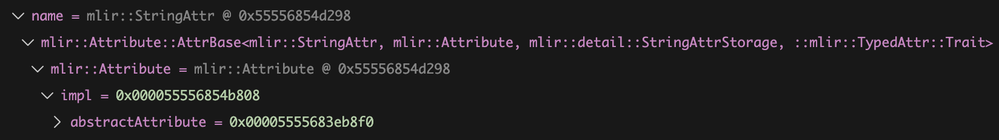

# MLIR StringAttr

<br/>

```C++
// llvm-project/build/tools/mlir/include/mlir/IR/BuiltinAttributes.h.inc
class StringAttr : public ::mlir::Attribute::AttrBase<StringAttr, ::mlir::Attribute, detail::StringAttrStorage, ::mlir::TypedAttr::Trait> {
public:
  using Base::Base;
};


// llvm-project/mlir/include/mlir/IR/Attributes.h
class Attribute {
public:
  template <typename ConcreteType, typename BaseType, typename StorageType,
            template <typename T> class... Traits>
  using AttrBase = detail::StorageUserBase<ConcreteType, BaseType, StorageType,
                                           detail::AttributeUniquer, Traits...>;

  using ImplType = AttributeStorage;

  /* implicit */ Attribute(const ImplType *impl)
      : impl(const_cast<ImplType *>(impl)) {}

protected:
  ImplType *impl{nullptr};
};


// llvm-project/mlir/include/mlir/IR/StorageUniquerSupport.h
template <typename ConcreteT, typename BaseT, typename StorageT,
          typename UniquerT, template <typename T> class... Traits>
class StorageUserBase : public BaseT, public Traits<ConcreteT>... {
public:
  using BaseT::BaseT;

  using ImplType = StorageT;

  /// Utility for easy access to the storage instance.
  ImplType *getImpl() const { return static_cast<ImplType *>(this->impl); }
};
```
<br/>

So the inheritance tree:<br/>
```C++
StringAttr -> StorageUserBase<StringAttr, mlir::Attribute, detail::StringAttrStorage, detail::AttributeUniquer, mlir::TypedAttr::Trait> -> mlir::Attribute
```
<br/>

The real type of the `impl` data member is `detail::StringAttrStorage*`. <br/>
llvm-project/mlir/lib/IR/AttributeDetail.h
```C++
struct StringAttrStorage : public AttributeStorage {
  StringAttrStorage(StringRef value, Type type)
      : type(type), value(value), referencedDialect(nullptr) {}

  /// The type of the string.
  Type type;
  /// The raw string value.
  StringRef value;
  /// If the string value contains a dialect namespace prefix (e.g.
  /// dialect.blah), this is the dialect referenced.
  Dialect *referencedDialect;
}
```
<br/>

Though `detail::StringAttrStorage` has 3 data members `type`, `value`, and `referencedDialect`, in an `Attribute` subobject, the `impl` is of `AttributeStorage*` type.<br/>
Therefore, those 3 data members are hidden.
<br/>


Note that `StringAttr` inherits `StorageUserBase<StringAttr, mlir::Attribute, detail::StringAttrStorage, detail::AttributeUniquer, mlir::TypedAttr::Trait>`:
```C++
template <typename ConcreteT, typename BaseT, typename StorageT,
          typename UniquerT, template <typename T> class... Traits>
class StorageUserBase : public BaseT, public Traits<ConcreteT>... {
public:
  using ImplType = StorageT;

  /// Utility for easy access to the storage instance.
  ImplType *getImpl() const { return static_cast<ImplType *>(this->impl); }
```
`ImplType` is an alias of `StorageT` which actually is `detail::StringAttrStorage` which inherits from `AttributeStorage`. <br/>

`this->impl` actually is a `detail::StringAttrStorage*` pointer but in an `Attribute` subobject it is stored as an `AttributeStorage*` pointer:
```C++
class Attribute {
public:
  using ImplType = AttributeStorage;

  /* implicit */ Attribute(const ImplType *impl)
      : impl(const_cast<ImplType *>(impl)) {}

protected:
  ImplType *impl{nullptr};
};
```

When `stringAttr.getImpl()` is called, `StorageUserBase::getImpl()` will be called because `StorageUserBase` is the direct base class of `StringAttr`. <br/>
Therefore, `StorageUserBase::getImpl()` will perform a down-cast from `AttributeStorage*` to `detail::StringAttrStorage*`. <br/>
Finally, we can get the `value` from `stringAttr.getImpl()->value`.
