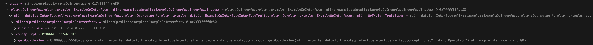

<!-- TOC START -->
- [MLIR Interface](#mlir-interface)
  - [How `iface` is created](#how-iface-is-created)
  - [Concept-based Polymorphism](#concept-based-polymorphism)
    - [The Problem with Traditional Polymorphism](#the-problem-with-traditional-polymorphism)
    - [The Solution: Concept-Based Polymorphism](#the-solution-concept-based-polymorphism)
      - [1. The Concept (The Contract)](#1-the-concept-the-contract)
      - [2. The Model (The Bridge)](#2-the-model-the-bridge)
      - [3. The Wrapper (The Type Eraser)](#3-the-wrapper-the-type-eraser)
    - [The Ultimate Superpower: Retroactive Interfaces](#the-ultimate-superpower-retroactive-interfaces)
  - [CustomOp and ExampleOpInterface](#customop-and-exampleopinterface)
    - [1. The Setup: The Context's Secret Dictionary](#1-the-setup-the-contexts-secret-dictionary)
    - [2. The Connection: `dyn_cast`](#2-the-connection-dyn_cast)
    - [Summary of the Flow](#summary-of-the-flow)
  - [Model<CustomOp> plays the role of a vtable](#modelcustomop-plays-the-role-of-a-vtable)
    - [Traditional C++ (The Bloat)](#traditional-c-the-bloat)
    - [MLIR's Approach (The Solution)](#mlirs-approach-the-solution)
  - [ExampleOpInterface and ExampleOpInterface::Trait](#exampleopinterface-and-exampleopinterfacetrait)
    - [1. The Core Role: Consumer vs. Provider](#1-the-core-role-consumer-vs-provider)
    - [2. When They Operate: Runtime vs. Compile-Time](#2-when-they-operate-runtime-vs-compile-time)
    - [3. Memory and Structure: Value Type vs. CRTP Template](#3-memory-and-structure-value-type-vs-crtp-template)
    - [Summary Comparison](#summary-comparison)
  - [ExampleOpInterface::Trait and detail::ExampleOpInterfaceInterfaceTraits](#exampleopinterfacetrait-and-detailexampleopinterfaceinterfacetraits)
    - [The Inheritance Chain (Tracing the Code)](#the-inheritance-chain-tracing-the-code)
    - [The Connection Point: `mlir::OpInterface`](#the-connection-point-mliropinterface)
    - [Why does this connection matter?](#why-does-this-connection-matter)
    - [Summary](#summary)
  - [How Model is registered to MLIRContext](#how-model-is-registered-to-mlircontext)
<!-- TOC END -->


# MLIR Interface
The client code:
```C++
    if (auto iface = dyn_cast<example::ExampleOpInterface>(op)) {
      llvm::outs() << op->getName() << " magic number: " 
                   << iface.getMagicNumber() << "\n";
    } else {
      llvm::outs() << op->getName() << " does not implement ExampleOpInterface.\n";
    }
```
iface:<br/>

<br/>


## Diagrams
https://docs.google.com/presentation/d/1BLqGNuN5tHH1dpH9-Z3W83pZIAEGnkt6vfw9L-VEsR0/edit?slide=id.g3d194b30dd3_0_33#slide=id.g3d194b30dd3_0_33


## How `iface` is created
**Call Stack:**
```C++
mlir::detail::Interface<mlir::example::ExampleOpInterface, mlir::Operation*, mlir::example::detail::ExampleOpInterfaceInterfaceTraits, mlir::Op<mlir::example::ExampleOpInterface>, mlir::OpTrait::TraitBase>::Interface(mlir::Operation*) (/data00/home/son.nguyen/workspace/learnmlir/llvm-project/mlir/include/mlir/Support/InterfaceSupport.h:95)
mlir::OpInterface<mlir::example::ExampleOpInterface, mlir::example::detail::ExampleOpInterfaceInterfaceTraits>::OpInterface(mlir::Operation*) (/data00/home/son.nguyen/workspace/learnmlir/llvm-project/mlir/include/mlir/IR/OpDefinition.h:2094)
mlir::example::ExampleOpInterface::ExampleOpInterface(mlir::Operation*) (/data00/home/son.nguyen/workspace/learnmlir/examples/mlir_interface/build/ExampleInterface.h.inc:53)
llvm::ValueFromPointerCast<mlir::example::ExampleOpInterface, mlir::Operation, llvm::CastInfo<mlir::example::ExampleOpInterface, mlir::Operation*, void>>::doCast(mlir::Operation*) (/data00/home/son.nguyen/workspace/learnmlir/llvm-project/llvm/include/llvm/Support/Casting.h:335)
llvm::DefaultDoCastIfPossible<mlir::example::ExampleOpInterface, mlir::Operation*, llvm::CastInfo<mlir::example::ExampleOpInterface, mlir::Operation*, void>>::doCastIfPossible(mlir::Operation*) (/data00/home/son.nguyen/workspace/learnmlir/llvm-project/llvm/include/llvm/Support/Casting.h:313)
decltype(auto) llvm::dyn_cast<mlir::example::ExampleOpInterface, mlir::Operation>(mlir::Operation*) (/data00/home/son.nguyen/workspace/learnmlir/llvm-project/llvm/include/llvm/Support/Casting.h:663)
main::$_0::operator()(mlir::Operation*) const (/data00/home/son.nguyen/workspace/learnmlir/examples/mlir_interface/main.cpp:36)
main (/data00/home/son.nguyen/workspace/learnmlir/examples/mlir_interface/main.cpp:46)
__libc_start_call_main (libc_start_call_main.h:58)
__libc_start_main_impl (libc-start.c:360)
_start (:12)
```
<br/>

The following inherited ctor `Interface(ValueT t = ValueT())` is called:<br/>
llvm-project/mlir/include/mlir/Support/InterfaceSupport.h
```C++
template <typename ConcreteType, typename ValueT, typename Traits,
          typename BaseType,
          template <typename, template <typename> class> class BaseTrait>
class Interface : public BaseType {
public:
  using Concept = typename Traits::Concept;
  template <typename T>
  using Model = typename Traits::template Model<T>;
  template <typename T>
  using FallbackModel = typename Traits::template FallbackModel<T>;
  using InterfaceBase =
      Interface<ConcreteType, ValueT, Traits, BaseType, BaseTrait>;
  template <typename T, typename U>
  using ExternalModel = typename Traits::template ExternalModel<T, U>;
  using ValueType = ValueT;

  /// Construct an interface from an instance of the value type.
  explicit Interface(ValueT t = ValueT())
      : BaseType(t),
        conceptImpl(t ? ConcreteType::getInterfaceFor(t) : nullptr) {
    assert((!t || conceptImpl) &&
           "expected value to provide interface instance");
  }

}

// ValueT = Operation*
// ConcreteType = ExampleOpInterface
// BaseType = mlir::Op<mlir::example::ExampleOpInterface>
```

The `Interface(ValueT t = ValueT())` creates a `mlir::Op<mlir::example::ExampleOpInterface>` instance from the `op` argument.<br/>
Since `ExampleOpInterface::getInterfaceFor(op)` returns a pointer to `detail::ExampleOpInterfaceInterfaceTraits::Model<CustomOp>`, `conceptImpl` is initialized to this pointer.
<br/>

## Concept-based Polymorphism
Concept-based polymorphism (often referred to interchangeably with **type erasure**) is a powerful C++ design pattern. It allows you to write generic code that handles different types uniformly, *without* forcing those types to inherit from a common base class or use virtual functions.

To understand why MLIR uses this, it helps to look at the problem it solves.

### The Problem with Traditional Polymorphism
In standard object-oriented C++, if you want a generic `getMagicNumber()` function, you create a base class with a `virtual` method:

```cpp
class MagicInterface {
public:
  virtual int getMagicNumber() = 0;
};

class CustomOp : public MagicInterface { ... };
```

This has two major drawbacks for a compiler infrastructure like MLIR:
1. **Memory Bloat (The VTable Pointer):** Every single operation instance in memory would need a hidden pointer (the vptr) to resolve virtual function calls. In a compiler with millions of IR nodes, this wastes a massive amount of memory and ruins cache locality.
2. **Intrusive Inheritance:** You can only use the interface if you modify the original class to inherit from `MagicInterface`. You cannot retroactively make a third-party class implement your interface.

### The Solution: Concept-Based Polymorphism
Concept-based polymorphism fixes this by moving the inheritance and virtual dispatch *out* of the object itself and into a hidden side-channel. 

It relies on three main components. Here is how they map directly to the MLIR code you generated earlier:

#### 1. The Concept (The Contract)
The Concept defines what methods the interface requires. However, instead of the concrete operation inheriting from it, it exists purely as an abstract definition. 

In MLIR's generated code, this is a struct of function pointers:
```cpp
struct Concept {
  int (*getMagicNumber)(const Concept *impl, ::mlir::Operation *);
};
```
*Notice:* `CustomOp` knows absolutely nothing about this struct.

#### 2. The Model (The Bridge)
The Model is a templated class that "bridges" the generic Concept to a specific, concrete type. It knows how to translate the interface's demands into the specific methods of the concrete class.

In your MLIR code, the framework generates a `Model` for every operation that claims to implement the interface:
```cpp
template<typename ConcreteOp>
class Model : public Concept {
public:
  Model() : Concept{getMagicNumber} {} // Wire up the function pointer

  static inline int getMagicNumber(const Concept *impl, ::mlir::Operation *op) {
    // Safely cast the opaque pointer back to the real type, 
    // and call its normal, non-virtual C++ method.
    return (llvm::cast<ConcreteOp>(op)).getMagicNumber();
  }
};
```
When `CustomOp` is registered, MLIR instantiates `Model<CustomOp>` once and stores it in a registry inside the `MLIRContext`.

#### 3. The Wrapper (The Type Eraser)
This is the class you actually interact with. It acts as a lightweight proxy. It holds two things: a pointer to the actual data (the operation), and a pointer to the Concept (the behavior).

In your code, this is the `ExampleOpInterface` class:
```cpp
class ExampleOpInterface {
  Operation *op;         // The opaque data
  const Concept *concept; // The behavior dictionary

public:
  int getMagicNumber() {
    // Delegate the call through the concept's function pointer
    return concept->getMagicNumber(concept, op);
  }
};
```

### The Ultimate Superpower: Retroactive Interfaces
Because the operation (`CustomOp`) and the interface mechanism (`Model` and `Concept`) are completely decoupled, you gain a massive advantage: **you can write interfaces for types you don't own.**

For example, imagine you want the standard `arith.addi` operation (built into MLIR) to implement your `ExampleOpInterface`. You cannot modify the `arith` dialect's source code. 

With concept-based polymorphism, you don't have to. You can use the **`ExternalModel`** (which was generated in your C++ snippet). You simply define how `arith.addi` should behave, instantiate an `ExternalModel<MyArithModel, arith::AddIOp>`, and register it with the `MLIRContext`. From then on, any `dyn_cast<ExampleOpInterface>` on an `arith.addi` operation will succeed.


## CustomOp and ExampleOpInterface
The connection happens dynamically inside the **MLIR infrastructure**—specifically, when you attempt to cast the operation using `dyn_cast`. 

The `MLIRContext` acts as a "matchmaker" between your `CustomOp` data and the `Concept` behavior. Here is exactly how that connection is made:

### 1. The Setup: The Context's Secret Dictionary
When you load your dialect into the `MLIRContext` (via `context.getOrLoadDialect<ExampleDialect>()`), MLIR does some hidden bookkeeping. 

Because `CustomOp` was defined with the `ExampleOpInterface::Trait`, the MLIR framework automatically instantiates the `Model<CustomOp>` (which, remember, is just a subclass of `Concept`). It then stores a pointer to this `Concept` in a massive dictionary inside the `MLIRContext`.

This dictionary maps the unique **TypeID** of an operation to its registered **Concept pointers**:
* `TypeID(CustomOp)` ➔ `Concept*` (specifically, the `Model<CustomOp>` instance)
* `TypeID(DefaultOp)` ➔ `Concept*` (specifically, the `Model<DefaultOp>` instance)


Notice that `CustomOp` instances themselves *do not* store the `Concept*`. They only store their data and their `TypeID`. 

### 2. The Connection: `dyn_cast`
The actual wiring of the `op` and `concept` data members happens the moment you call `dyn_cast`.

When you write this line of code:
```cpp
Operation *rawOp = customOp.getOperation();
auto iface = dyn_cast<ExampleOpInterface>(rawOp);
```

Here is what MLIR's `dyn_cast` is doing under the hood to populate those two fields:

1. **Find the Data (`op`):** It already has the raw `Operation*` pointer (your `rawOp`), so that becomes the `op` member.
2. **Find the Behavior (`concept`):** * It looks at `rawOp` and asks, "What is your TypeID?" (Answer: `CustomOp`'s TypeID).
   * It goes to the `MLIRContext`'s dictionary and looks up `CustomOp`'s TypeID.
   * The dictionary returns the `Concept*` that was registered during setup.
3. **Assemble the Wrapper:** `dyn_cast` now has both pieces. It calls a hidden constructor on `ExampleOpInterface` that essentially looks like this:
   ```cpp
   // Pseudocode of what dyn_cast does internally
   ExampleOpInterface(Operation *op, const Concept *concept) {
       this->op = op;
       this->concept = concept;
   }
   ```

### Summary of the Flow
* **`CustomOp`** provides the pure data (and its TypeID).
* **`MLIRContext`** holds the behavior dictionary (`Concept` pointers).
* **`dyn_cast`** takes the data, looks up the correct behavior in the dictionary using the TypeID, and bundles them both together into the `ExampleOpInterface` wrapper.

Once `dyn_cast` returns that wrapper, you have an object that contains both the specific `Operation*` and the specific `Concept*` needed to execute `iface.getMagicNumber()`. 


## Model<CustomOp> plays the role of a vtable
This is the exact core design philosophy behind MLIR's interface system. **`Model<ConcreteOp>` is exactly a vtable**, but instead of storing a pointer to it inside every single object, MLIR stores it globally in the `MLIRContext`.

Here is a quick breakdown of why this completely solves the Memory Bloat problem:


### Traditional C++ (The Bloat)
In standard C++, if `CustomOp` had virtual functions, the compiler would silently inject a **vptr** (virtual pointer, usually 8 bytes) into *every single instance* of `CustomOp` you create. 
* If you compile a program that generates 1,000,000 `CustomOp` operations, you instantly consume **8 Megabytes** of memory just storing duplicate `vptr`s that all point to the exact same vtable.
* Furthermore, these pointers ruin cache locality because the CPU has to dereference the pointer inside the object to find the function it needs to call.

### MLIR's Approach (The Solution)
In MLIR, the `Operation` class is heavily optimized. It contains only what is strictly necessary (pointers to its operands, results, attributes, and its `OperationName`/`TypeID`). **There is no vptr.**

Instead of putting the vptr in the object:
1. MLIR creates **exactly one** instance of `Model<CustomOp>` (your vtable) when the dialect is initialized.
2. It stores this single instance inside a hash map inside the `MLIRContext`, keyed by the operation's `TypeID`.
3. If you create 1,000,000 `CustomOp` instances, the memory overhead for the interface is **0 bytes**. 

The tradeoff is that when you call `dyn_cast<ExampleOpInterface>(op)`, MLIR has to do a quick hash map lookup in the `MLIRContext` to find the `Model` rather than just dereferencing a pointer. However, because compiler transformations usually cast once and then call interface methods many times, this tradeoff heavily favors MLIR's design.


## ExampleOpInterface and ExampleOpInterface::Trait
To put it simply, `ExampleOpInterface` and `ExampleOpInterface::Trait` represent the two opposite ends of the interface system. They are two sides of the same coin, but they are used by completely different people at completely different times.

Here is the breakdown of the key differences:

### 1. The Core Role: Consumer vs. Provider

* **`ExampleOpInterface` is for the Consumer (The Caller):** This is the class you use when you are writing a compiler pass or an analysis. You don't know (or care) what the specific operation is. You just want to wrap a generic `Operation*` and call `getMagicNumber()`. It is the **Wrapper**.
* **`ExampleOpInterface::Trait` is for the Provider (The Callee):**
    This is the class you use when you are defining a brand new operation (like `CustomOp`). You add this trait to your operation's inheritance list to loudly declare: *"I implement this interface!"* It is the **Mixin**.

### 2. When They Operate: Runtime vs. Compile-Time

* **`ExampleOpInterface` operates at Runtime:**
    It is used dynamically. When your compiler is actively compiling user code, it uses `dyn_cast<ExampleOpInterface>(op)` to check *at runtime* if a random operation happens to support the interface.
* **`ExampleOpInterface::Trait` operates at Compile-Time:**
    It is entirely resolved by the C++ compiler when you are building MLIR itself. By inheriting from it, you allow C++ template metaprogramming to inject default methods (like returning `42`) directly into your `CustomOp` class.

### 3. Memory and Structure: Value Type vs. CRTP Template

* **`ExampleOpInterface` is a lightweight value type:**
    It is not a template. It is just a tiny struct containing two pointers: one pointing to the raw `Operation*`, and one pointing to the hidden vtable (`Concept*`). It exists to erase the concrete type.
* **`ExampleOpInterface::Trait` is a CRTP template (`template <typename ConcreteOp>`):**
    It heavily relies on the Curiously Recurring Template Pattern. It takes your specific operation class as a template parameter so that it knows exactly which C++ type to inject the default interface methods into.

---

### Summary Comparison

| Feature | `ExampleOpInterface` (The Wrapper) | `ExampleOpInterface::Trait` (The Mixin) |
| :--- | :--- | :--- |
| **Who uses it?** | Generic compiler passes and analyses. | The concrete operation class (e.g., `CustomOp`). |
| **What does it do?** | Performs dynamic dispatch (calls the vtable). | Provides default method implementations. |
| **How is it used?** | `dyn_cast<ExampleOpInterface>(op)` | `class CustomOp : public Op<..., Trait>` |
| **Phase** | Run-time type erasure. | Compile-time structural inheritance. |

In short: you use the **`Trait`** to *build* the operation, and you use the **Wrapper** (`ExampleOpInterface`) to *use* the operation. 


## ExampleOpInterface::Trait and detail::ExampleOpInterfaceInterfaceTraits
They do very different things, but they are physically connected through C++ inheritance. 

Think of it like this:
* **`example::ExampleOpInterface::Trait`** is the **"Plugin"** that you attach to your `CustomOp`.
* **`detail::ExampleOpInterfaceInterfaceTraits`** is the **"Blueprint"** that holds the `Concept` and `Model` (the vtable mechanics).

The connection between them is a deliberate C++ template inheritance chain. Here is exactly how the "Plugin" connects your operation to the "Blueprint".

### The Inheritance Chain (Tracing the Code)

When you defined `CustomOp` in TableGen, you told it to inherit from `ExampleOpInterface::Trait`. If we follow that inheritance up the chain in your generated C++ code, we find exactly where the two concepts meet.

**Level 1: Your Operation**
```cpp
class CustomOp : public mlir::Op<CustomOp, ExampleOpInterface::Trait> { ... };
```

**Level 2: The Generated Wrapper Trait**
Inside the generated `ExampleOpInterface` class, `Trait` is just a thin wrapper:
```cpp
template <typename ConcreteOp>
struct Trait : public detail::ExampleOpInterfaceTrait<ConcreteOp> {};
```

**Level 3: The Default Implementation Injector**
This next level provides the default methods (like returning `42`). But look closely at what *it* inherits from:
```cpp
template <typename ConcreteOp>
struct ExampleOpInterfaceTrait : public ::mlir::OpInterface<
    ExampleOpInterface, 
    detail::ExampleOpInterfaceInterfaceTraits // <--- THERE IT IS!
>::Trait<ConcreteOp> {
    int getMagicNumber() { return 42; } 
};
```

### The Connection Point: `mlir::OpInterface`
At the very top of the inheritance chain, we hit MLIR's core C++ library: `mlir::OpInterface::Trait`. 

Notice that this core base class takes two template parameters:
1.  The interface wrapper (`ExampleOpInterface`)
2.  **The Blueprint container (`detail::ExampleOpInterfaceInterfaceTraits`)**

This is the exact bridge. By attaching the `Trait` plugin to `CustomOp`, you forced `CustomOp` to inherit a base class that is heavily templated on the `...InterfaceTraits` blueprint.

### Why does this connection matter?
Remember Step 4 of the registration process, where MLIR uses template metaprogramming to build the vtable? It uses this exact inheritance chain to find the vtable.

When you call `addOperations<CustomOp>()`, MLIR's core library interrogates `CustomOp`:
1.  *"What traits do you have?"* (It sees `ExampleOpInterface::Trait`).
2.  *"What is the base class of that trait?"* (It traces it up to `mlir::OpInterface<..., detail::ExampleOpInterfaceInterfaceTraits>::Trait`).
3.  *"Ah! I found the blueprint!"* (It extracts `detail::ExampleOpInterfaceInterfaceTraits`).
4.  *"Now, give me the Model."* (It reaches inside the blueprint, grabs `Model<CustomOp>`, and instantiates your vtable).

### Summary
* `ExampleOpInterface::Trait` is the **vehicle** that carries the interface into your operation.
* `detail::ExampleOpInterfaceInterfaceTraits` is the **payload** inside that vehicle. 
* Because your operation inherits the vehicle, MLIR's registration system can unpack the payload, find the `Model`, and wire up the dynamic dispatch (concept-based polymorphism) automatically.


## How Model is registered to MLIRContext
Call Stack:
```C++
void mlir::detail::InterfaceMap::insertModel<mlir::example::detail::ExampleOpInterfaceInterfaceTraits::Model<mlir::example::CustomOp>>() (/data00/home/son.nguyen/workspace/learnmlir/llvm-project/mlir/include/mlir/Support/InterfaceSupport.h:237)
void mlir::detail::InterfaceMap::insertPotentialInterface<mlir::example::ExampleOpInterface::Trait<mlir::example::CustomOp>>() (/data00/home/son.nguyen/workspace/learnmlir/llvm-project/mlir/include/mlir/Support/InterfaceSupport.h:225)
mlir::detail::InterfaceMap mlir::detail::InterfaceMap::get<mlir::OpTrait::ZeroRegions<mlir::example::CustomOp>, mlir::OpTrait::ZeroResults<mlir::example::CustomOp>, mlir::OpTrait::ZeroSuccessors<mlir::example::CustomOp>, mlir::OpTrait::ZeroOperands<mlir::example::CustomOp>, mlir::OpTrait::OpInvariants<mlir::example::CustomOp>, mlir::example::ExampleOpInterface::Trait<mlir::example::CustomOp>>() (/data00/home/son.nguyen/workspace/learnmlir/llvm-project/mlir/include/mlir/Support/InterfaceSupport.h:199)
mlir::Op<mlir::example::CustomOp, mlir::OpTrait::ZeroRegions, mlir::OpTrait::ZeroResults, mlir::OpTrait::ZeroSuccessors, mlir::OpTrait::ZeroOperands, mlir::OpTrait::OpInvariants, mlir::example::ExampleOpInterface::Trait>::getInterfaceMap() (/data00/home/son.nguyen/workspace/learnmlir/llvm-project/mlir/include/mlir/IR/OpDefinition.h:1877)
mlir::RegisteredOperationName::Model<mlir::example::CustomOp>::Model(mlir::Dialect*) (/data00/home/son.nguyen/workspace/learnmlir/llvm-project/mlir/include/mlir/IR/OperationSupport.h:533)
std::__detail::_MakeUniq<mlir::RegisteredOperationName::Model<mlir::example::CustomOp>>::__single_object std::make_unique<mlir::RegisteredOperationName::Model<mlir::example::CustomOp>, mlir::Dialect*>(mlir::Dialect*&&) (/usr/include/c++/12/bits/unique_ptr.h:1065)
void mlir::RegisteredOperationName::insert<mlir::example::CustomOp>(mlir::Dialect&) (/data00/home/son.nguyen/workspace/learnmlir/llvm-project/mlir/include/mlir/IR/OperationSupport.h:686)
void mlir::Dialect::addOperations<mlir::example::CustomOp, mlir::example::DefaultOp>() (/data00/home/son.nguyen/workspace/learnmlir/llvm-project/mlir/include/mlir/IR/Dialect.h:283)
mlir::example::ExampleDialect::initialize() (/data00/home/son.nguyen/workspace/learnmlir/examples/mlir_interface/Dialect.cpp:13)
mlir::example::ExampleDialect::ExampleDialect(mlir::MLIRContext*) (/data00/home/son.nguyen/workspace/learnmlir/examples/mlir_interface/build/ExampleDialect.cpp.inc:19)
mlir::example::ExampleDialect* mlir::MLIRContext::getOrLoadDialect<mlir::example::ExampleDialect>()::'lambda'()::operator()() const (/data00/home/son.nguyen/workspace/learnmlir/llvm-project/mlir/include/mlir/IR/MLIRContext.h:103)
std::unique_ptr<mlir::Dialect, std::default_delete<mlir::Dialect>> llvm::function_ref<std::unique_ptr<mlir::Dialect, std::default_delete<mlir::Dialect>> ()>::callback_fn<mlir::example::ExampleDialect* mlir::MLIRContext::getOrLoadDialect<mlir::example::ExampleDialect>()::'lambda'()>(long) (/data00/home/son.nguyen/workspace/learnmlir/llvm-project/llvm/include/llvm/ADT/STLFunctionalExtras.h:46)
llvm::function_ref<std::unique_ptr<mlir::Dialect, std::default_delete<mlir::Dialect>> ()>::operator()() const (/data00/home/son.nguyen/workspace/learnmlir/llvm-project/llvm/include/llvm/ADT/STLFunctionalExtras.h:69)
mlir::MLIRContext::getOrLoadDialect(llvm::StringRef, mlir::TypeID, llvm::function_ref<std::unique_ptr<mlir::Dialect, std::default_delete<mlir::Dialect>> ()>) (/data00/home/son.nguyen/workspace/learnmlir/llvm-project/mlir/lib/IR/MLIRContext.cpp:491)
mlir::example::ExampleDialect* mlir::MLIRContext::getOrLoadDialect<mlir::example::ExampleDialect>() (/data00/home/son.nguyen/workspace/learnmlir/llvm-project/mlir/include/mlir/IR/MLIRContext.h:102)
main (/data00/home/son.nguyen/workspace/learnmlir/examples/mlir_interface/main.cpp:24)
__libc_start_call_main (libc_start_call_main.h:58)
__libc_start_main_impl (libc-start.c:360)
_start (:12)
```
