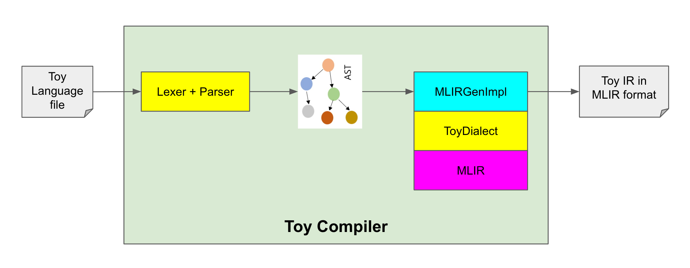

# Toy MLIR
https://mlir.llvm.org/docs/Tutorials/Toy/

## Flow Diagram

- `ToyDialect` is built on top of MLIR
- Toy Compiler loads `ToyDialect` into MLIR
- Toy Compiler calls `Lexer` and `Parser` to produce Toy AST
- Toy Compiler calls `MLIRGenImpl` methods to generate Toy IR in MLIR format