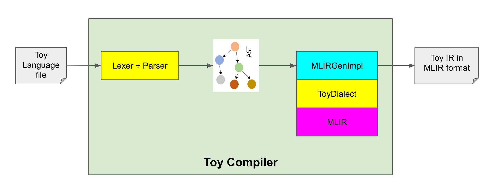

# Chapter 2
## How to build
```Bash
./build.sh
```

## How to run
```Bash
./run.sh
```

## Flow Diagram


- `ToyDialect` is built on top of MLIR
- Toy Compiler loads `ToyDialect` into MLIR
- Toy Compiler calls `Lexer` and `Parser` to produce Toy AST
- Toy Compiler calls `MLIRGenImpl` methods to generate Toy IR in MLIR format

## How does MLIR load `ToyDialect`?
