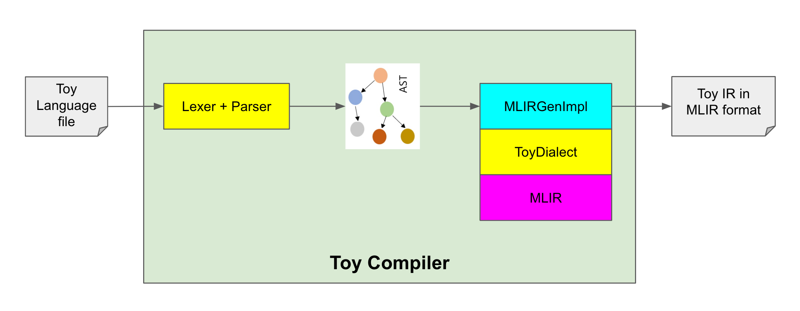

# Toy Tutorial

This contains sample code to support the tutorial on using MLIR for
building a compiler for a simple Toy language.

See [docs/Tutorials/Toy](../../docs/Tutorials/Toy) at the root of
the project for more informations.

**How to build**
```Bash
# Generate dialect definitions
./tablegen.sh

# Build a target chapter
./build.sh TARGET_CHAPTER
```

## Chapter 2
### Flow Diagram


- `ToyDialect` is built on top of MLIR
- Toy Compiler loads `ToyDialect` into MLIR
- Toy Compiler calls `Lexer` and `Parser` to produce Toy AST
- Toy Compiler calls `MLIRGenImpl` methods to generate Toy IR in MLIR format